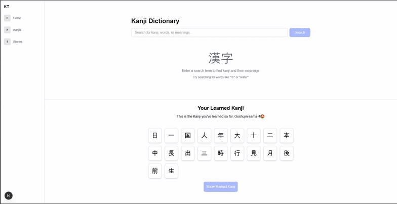

# KanjiTales 📚✨

A simple webapp where users can add kanji they have learned and generate short stories or sentences to reinforce their learning. 
Kanji Tales use AI from Google Gemini api to generate stories/sentence with or without the kanji of choice. 

## Demo



## Features (current or planned)

- **Kanji Collection**: Add and manage kanji characters you've learned
- **Sentence Builder**: Generate sentences using your learned kanji
- **Story Generation**: Create short stories incorporating your kanji
- **Interactive Learning**: Engage with kanji through creative writing

## Tech Stack

- **NextJS**
- **TypeScript** 
- **Tailwind CSS** 

## Getting Started

### Prerequisites

- Node.js (version 14 or higher)
- npm

### Installation

1. Clone the repository:
```bash
git clone https://github.com/xTaig4/KanjiTales.git
cd KanjiTales
```

2. Install dependencies:
```bash
npm install
```


3. Create ".env.local" file and add google gemini api key or similiar ai in the file
```bash
NEXT_PUBLIC_GEMINI_API_KEY=your_key_here
```

5. Start the development server:
```bash
npm start
```

5. Open your browser and navigate to `http://localhost:3000`

