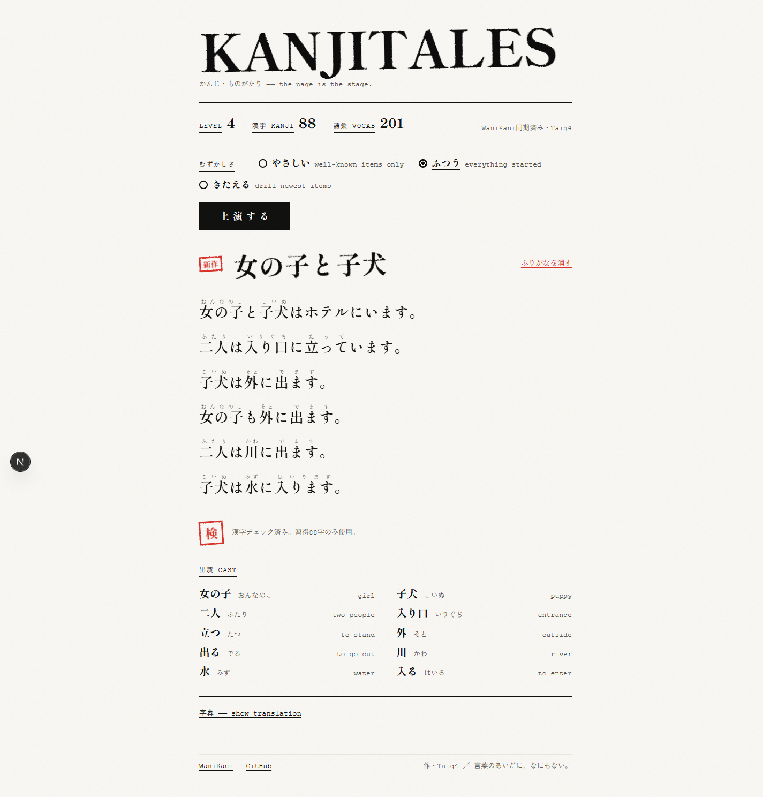
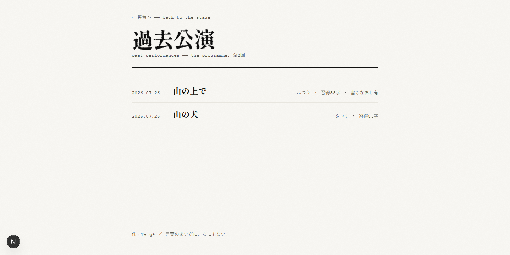

# KanjiTales 幕

Tiny Japanese stories you can actually read — generated from the kanji and vocabulary you've learned on [WaniKani](https://www.wanikani.com), and machine-checked so no unknown kanji ever sneaks in.

The page is the stage: sumi ink on washi paper, a rough-stamped mincho masthead, red hanko seals, and stories that enter sentence by sentence like a performance.



## How it works

1. **Sync** — pulls your started kanji/vocab from the WaniKani API v2 (`/assignments` + `/subjects`).
2. **Write** — a Next.js API route shells out to headless Claude Code (`claude -p`), so generation runs on your Claude subscription. No API key.
3. **Check** — every kanji character in the draft is validated in code against your known set. Leaks are fed back to the model and the story is rewritten (up to 3 attempts). The red 検 seal on a story means it passed.
4. **Read** — heavy mincho with per-word furigana (off by default, one click to show), a cast list of the vocabulary used, and the English translation hidden behind 字幕 until you ask.

Difficulty modes: やさしい (Guru+ items only) / ふつう (everything started) / きたえる (drills your newest items).

Every story is saved automatically. **過去公演** (`/archive`) is the programme of past performances — reopen any story for an encore reading. Stories live as JSON files in `kanji_tales/data/stories/` (gitignored).



## Requirements

- Node.js 20+ (and [Bun](https://bun.sh) for the test scripts)
- [Claude Code](https://claude.com/claude-code) CLI installed and signed in (Pro/Max subscription)
- A WaniKani account + [personal access token](https://www.wanikani.com/settings/personal_access_tokens) (read-only is enough)

## Setup

```bash
cd kanji_tales
npm install
echo "WANIKANI_API_TOKEN=your-token-here" > .env.local
npm run dev
```

Open http://localhost:3000 and press 上演する.

## Tests

```bash
cd kanji_tales
bun test tests/                       # validation logic
bun run scripts/story-smoke.ts        # real generation pipeline against claude -p
bun run scripts/e2e-verify.ts x.json  # re-verify a generated story against live WaniKani data
```

Note: don't run `next build` while the dev server is running — they share `.next`.

## Design

The visual world ("Massin stage page × Japanese materials") is documented in [`kanji_tales/DESIGN.md`](kanji_tales/DESIGN.md); product context lives in [`kanji_tales/PRODUCT.md`](kanji_tales/PRODUCT.md).

## Tech

Next.js 15 · React 19 · Tailwind CSS 4 · WaniKani API v2 · Claude Code (headless)
